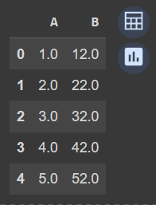

# Developing a Neural Network Regression Model

## AIM

To develop a neural network regression model for the given dataset.

## THEORY

Explain the problem statement

## Neural Network Model

Include the neural network model diagram.

## DESIGN STEPS

### STEP 1:

Loading the dataset

### STEP 2:

Split the dataset into training and testing

### STEP 3:

Create MinMaxScalar objects ,fit the model and transform the data.

### STEP 4:

Build the Neural Network Model and compile the model.

### STEP 5:

Train the model with the training data.

### STEP 6:

Plot the performance plot

### STEP 7:

Evaluate the model with the testing data.

## PROGRAM
### Name: Sowmiya N
### Register Number: 212221230106
```
from sklearn.preprocessing import MinMaxScaler
from sklearn.model_selection import train_test_split
from google.colab import auth
import gspread
from google.auth import default
import pandas as pd

auth.authenticate_user()
creds, _ = default()
gc = gspread.authorize(creds)

worksheet = gc.open('dl1').sheet1
data=worksheet.get_all_values()

dataset1=pd.DataFrame(data[1:],columns=data[0])
dataset1=dataset1.astype({'A':'float'})
dataset1=dataset1.astype({'B':'float'})
dataset1.head()

X = dataset1[['A']].values
y = dataset1[['B']].values

X

X_train,X_test,y_train,y_test = train_test_split(X,y,test_size = 0.33,random_state = 33)

import numpy as np
from sklearn.metrics import mean_squared_error
mse = mean_squared_error(X_test, y_test)
rmse = np.sqrt(mse)

print("Root Mean Squared Error:", rmse)

Scaler = MinMaxScaler()
Scaler.fit(X_train)

X_train1 = Scaler.transform(X_train)

from tensorflow.keras.models import Sequential
from tensorflow.keras.layers import Dense

Model = Sequential ([
    Dense(units = 5, activation ='relu', input_shape = [1]),
    Dense(units = 3, activation ='relu'),
    Dense(units = 4, activation ='relu'),
    Dense(units=1)
])

Model.compile(optimizer='rmsprop',loss='mse')

Model.fit(x=X_train1,y=y_train,epochs=2000)

loss_df = pd.DataFrame(Model.history.history)
loss_df.plot()

X_test1 = Scaler.transform(X_test)
Model.evaluate(X_test1,y_test)

X_n1 = [[30]]
X_n1_1 = Scaler.transform(X_n1)
Model.predict(X_n1_1)
```
## Dataset Information



## OUTPUT

### Values of X :


### Appling Scaler : 


### Evaluation: 


### Training Loss Vs Iteration Plot

#### Model fitting : 

#### Loss function Plot: 


### Test Data Root Mean Squared Error


### New Sample Data Prediction

#### Data set : 

#### Prediction :


```
Thus it is evident that on prediction we get the output as 52.29072 for the given input 5.
```
## RESULT
A neural network regression model for the given dataset is developed . 
